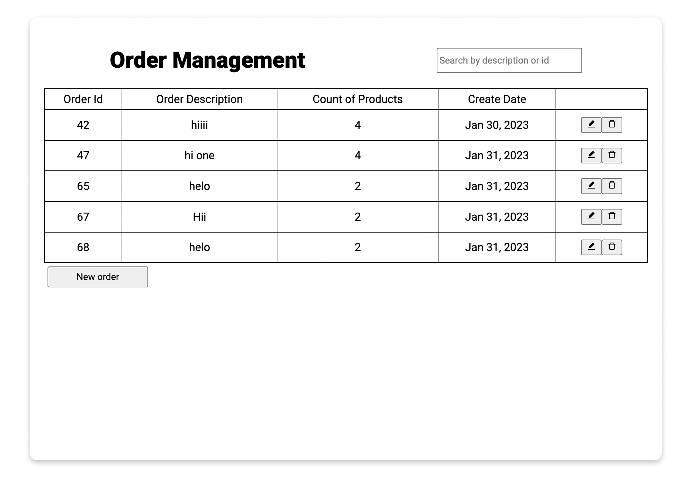
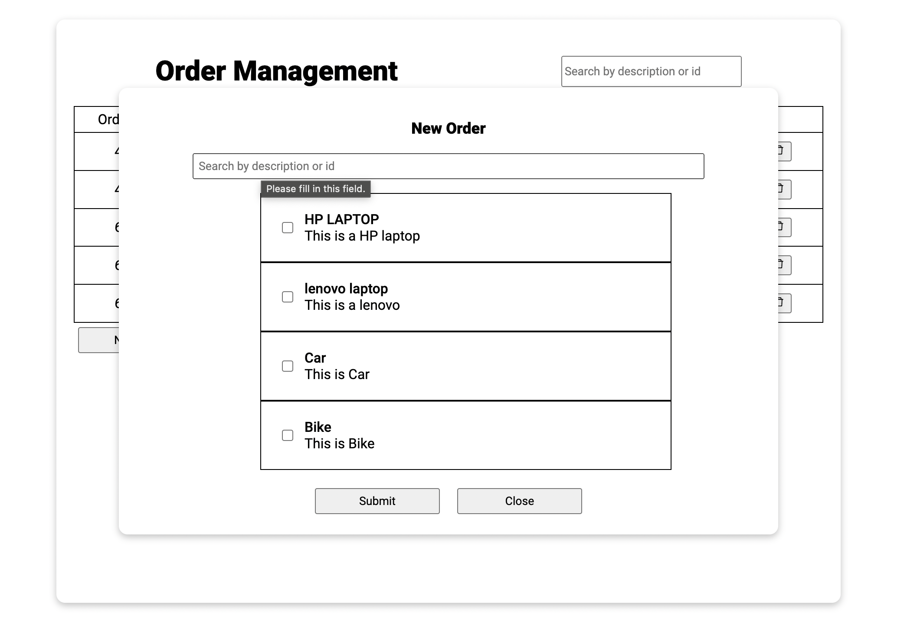

## crud-postgres

<div>
<a href="#overview">Overview</a> | <a href="#technologies">Built with</a> | <a href="#prerequisites">Prerequisites</a> | <a href="#installation">Installation</a> | <a href="#screenshots">Screenshots</a>
</div>
<div href="#overview"></div>
<p>This is an example of a CRUD application. To get a local copy up and running, follow these steps.</p>

## BUILT WITH

<div href="#technologies"></div>

```sh
React
styled-components
Express
PostgreSQL
```

## Prerequisites

<p>Install the latest version of Postgres and package managers such as yarn or npm..</p>

### Installation

<div href="#installation"></div>

1. Clone the repository.

   ```sh
   git clone https://github.com/alphawhiskey03/crud-postgres
   ```

2. Install server packages.

```sh
   cd ./server

   yarn install

   or

   npm install
```

3. Install client packages.

```sh
   cd ./client

   yarn install

   or

   npm install
```

4. Import the database file to set up the database.  <a href="https://github.com/alphawhiskey03/crud-postgres/blob/main/database.sql">`database.sql`</a> (Find the file in the main directory of the repository.)

### Screenshots

<div href="#screenshots"></div>

- Main page
  
- Order Modal
  
